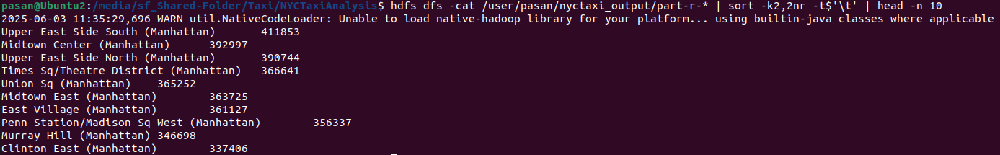
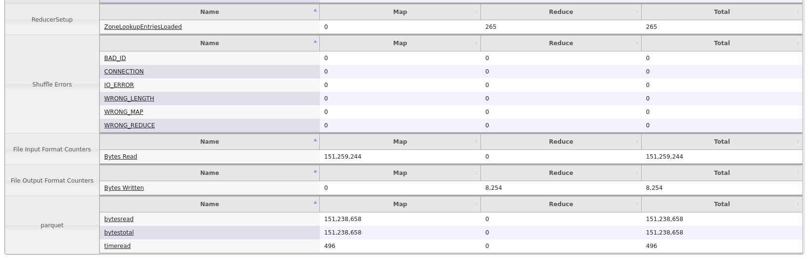
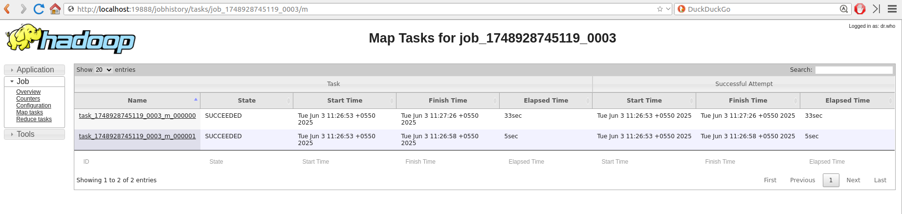
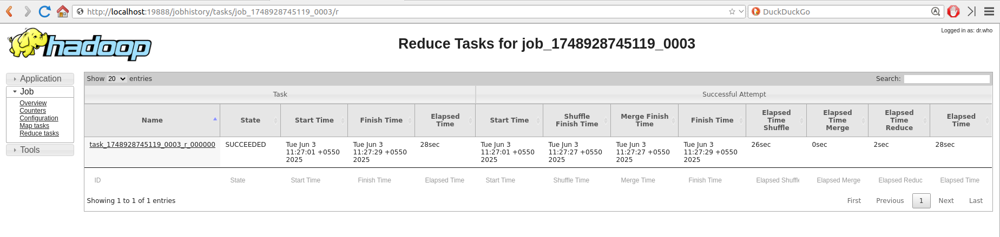

# NYC Taxi Pickup Hotspot Analysis using Hadoop MapReduce

This project analyzes one month of NYC Yellow Taxi trip data (January 2016) to identify the busiest taxi pickup locations. It utilizes the Hadoop MapReduce framework to process the data and a lookup table to map location IDs to human-readable zone names.

## Project Objective

The primary goal is to count the number of taxi pickups for each taxi zone in New York City and then identify the Top N busiest zones. This provides insights into areas with high taxi demand.

## Dataset

1.  **NYC Yellow Taxi Trip Data:**

    - **Source:** NYC Taxi & Limousine Commission (TLC) Trip Record Data
    - **File Used:** `yellow_tripdata_2016-01.parquet` (Data for January 2016)
    - **Format:** Apache Parquet
    - **Size:** Approximately 10.9 million records.
    - **Relevant Column:** `PULocationID` (Pickup Location ID).
    - **Download Link:** [yellow_tripdata_2016-01.parquet (January 2016)](https://d37ci6vzurychx.cloudfront.net/trip-data/yellow_tripdata_2016-01.parquet)

2.  **Taxi Zone Lookup Table:**
    - **Source:** NYC TLC - Taxi Zones
    - **File Used:** `taxi_zone_lookup.csv`
    - **Format:** CSV
    - **Relevant Columns:** `LocationID`, `Borough`, `Zone`
    - **Purpose:** To map the numeric `PULocationID` from the trip data to meaningful Borough and Zone names.
    - **Download Link:** [taxi_zone_lookup.csv](https://d37ci6vzurychx.cloudfront.net/misc/taxi_zone_lookup.csv)

## Technologies Used

- **Hadoop:** Version 3.3.X (or your specific version)
- **Java:** Version 8 (or your specific version) for MapReduce programming
- **Maven:** For project build and dependency management
- **Apache Parquet:** For efficient columnar storage of trip data
- **Python 3:** For post-processing and displaying Top N results

## MapReduce Workflow

The analysis involves a single MapReduce job with a Mapper, Combiner, and Reducer.

1.  **Mapper (`PickupLocationMapper.java`):**

    - **Input:** Each record from the `yellow_tripdata_2016-01.parquet` file.
    - **Process:**
      - For each taxi trip record, it extracts the `PULocationID`.
      - It handles potential `null` input records from the Parquet reader by skipping them and incrementing a counter.
    - **Output:** Emits intermediate key-value pairs: `(PULocationID, 1)`.

2.  **Combiner (`PickupLocationCombiner.java`):**

    - **Input:** Intermediate output from mappers on the same node: `(PULocationID, [1, 1, ..., 1])`.
    - **Process:** Sums the counts for each `PULocationID` locally.
    - **Output:** Emits aggregated key-value pairs: `(PULocationID, partial_sum_of_pickups)`.
    - **Purpose:** This step optimizes the job by reducing the amount of data shuffled across the network to the reducers.

3.  **Reducer (`PickupLocationReducer.java`):**
    - **Setup Phase:**
      - Loads the `taxi_zone_lookup.csv` file from the Hadoop DistributedCache into an in-memory `HashMap`. This map stores `LocationID` -> `{Borough, Zone}`.
      - Handles parsing of the CSV, including skipping the header, trimming values, and providing default values for missing borough/zone information.
    - **Reduce Phase:**
      - **Input:** Key-value pairs grouped by `PULocationID` from the combiner (or directly from mappers if no combiner was used/effective): `(PULocationID, [partial_sum1, partial_sum2, ...])`.
      - **Process:**
        - Sums all partial counts for a given `PULocationID` to get the `total_pickup_count`.
        - Looks up the `PULocationID` in the in-memory `zoneLookup` map to retrieve the `Borough` and `Zone` name.
        - If a `PULocationID` is not found in the lookup table, it uses default "Unknown" names and increments a counter.
      - **Output:** Emits final key-value pairs: `(Zone Name (Borough), total_pickup_count)`.

## Project Structure

```
NYCTaxiAnalysis/
├── pom.xml # Maven project configuration
├── src/
│ ├── main/
│ │ └── java/
│ │ └── com/
│ │ └── nyctaxi/
│ │ ├── NYCTaxiDriver.java # Main driver class for the MapReduce job
│ │ ├── PickupLocationMapper.java # Mapper class
│ │ ├── PickupLocationCombiner.java # Combiner class
│ │ └── PickupLocationReducer.java # Reducer class
│ └── test/ # (Optional: Unit tests)
├── target/
│ └── NYCTaxiAnalysis-1.0-SNAPSHOT.jar # Runnable JAR file
├── data/ # (Recommended: Local storage for input files before HDFS upload)
│ ├── yellow_tripdata_2016-01.parquet
│ └── taxi_zone_lookup.csv
└── scripts/ # (Recommended: For helper scripts)
└── get_top_n.py # Python script for post-processing
```

## Setup and Execution

### Prerequisites

- Java Development Kit (JDK) 8 or higher installed.
- Apache Maven installed.
- Hadoop (single-node or cluster) installed and running (HDFS and YARN).

### Steps

1.  **Clone the Repository (if applicable) or Create Project Structure:**

    ```bash
    git clone https://github.com/PasanAbeysekara/Taxi-Pickup-Hotspot-Analysis-using-Hadoop-MapReduce
    cd NYCTaxiAnalysis
    ```

2.  **Build the Project:**
    Navigate to the project root directory (`NYCTaxiAnalysis/`) and run:

    ```bash
    mvn clean package
    ```

    This will compile the Java code and create a fat JAR (`target/NYCTaxiAnalysis-1.0-SNAPSHOT.jar`) containing all dependencies.

3.  **Upload Data to HDFS:**
    Ensure your HDFS is running.

    ```bash
    # Create HDFS directories (if they don't exist)
    hdfs dfs -mkdir -p /user/<your_username>/nyctaxi_input
    hdfs dfs -mkdir -p /user/<your_username>/nyctaxi_lookup

    # Upload the Parquet trip data file
    hdfs dfs -put path/to/your/local/yellow_tripdata_2016-01.parquet /user/<your_username>/nyctaxi_input/

    # Upload the taxi zone lookup CSV file
    hdfs dfs -put path/to/your/local/taxi_zone_lookup.csv /user/<your_username>/nyctaxi_lookup/
    ```

    Replace `<your_username>` with your Hadoop username and `path/to/your/local/` with the actual local paths to your data files.

4.  **Run the MapReduce Job:**
    Before running, ensure any previous output directory is removed:

    ```bash
    hdfs dfs -rm -r /user/<your_username>/nyctaxi_output
    ```

    Then, execute the job:

    ```bash
    hadoop jar target/NYCTaxiAnalysis-1.0-SNAPSHOT.jar com.nyctaxi.NYCTaxiDriver \
    /user/<your_username>/nyctaxi_input/yellow_tripdata_2016-01.parquet \
    /user/<your_username>/nyctaxi_output \
    /user/<your_username>/nyctaxi_lookup/taxi_zone_lookup.csv
    ```

      
    

    You can monitor the job progress via the YARN ResourceManager UI, typically at `http://<your-resourcemanager-host>:8088`.

    
    

5.  **Retrieve and View Results:**
    Once the job completes successfully, the output will be in the HDFS directory `/user/<your_username>/nyctaxi_output/`. It will contain a `_SUCCESS` file and one or more `part-r-xxxxx` files.

    - **View raw output from HDFS (sample):**

      ```bash
      hdfs dfs -cat /user/<your_username>/nyctaxi_output/part-r-00000 | head
      ```

    
    

    - **Get Top N Busiest Locations using shell command:**

      ```bash
      hdfs dfs -cat /user/<your_username>/nyctaxi_output/part-r-* | sort -k2,2nr -t$'\t' | head -n 20
      ```

    

    - **Get Top N Busiest Locations using the Python script:**
      First, merge the output parts into a single local file:
      ```bash
      hdfs dfs -getmerge /user/<your_username>/nyctaxi_output/part-r-* local_output.txt
      ```
      Then, run the Python script (assuming `get_top_n.py` is in a `scripts/` directory or your current path):
      ```bash
      python3 scripts/get_top_n.py local_output.txt
      ```
      

## Results and Observations

The MapReduce job successfully processed ~10.9 million taxi trip records for January 2016.

### Top 20 Busiest Pickup Locations (January 2016):

1. Upper East Side South (Manhattan): 411853
2. Midtown Center (Manhattan): 392997
3. Upper East Side North (Manhattan): 390744
4. Times Sq/Theatre District (Manhattan): 366641
5. Union Sq (Manhattan): 365252
6. Midtown East (Manhattan): 363725
7. East Village (Manhattan): 361127
8. Penn Station/Madison Sq West (Manhattan): 356337
9. Murray Hill (Manhattan): 346698
10. Clinton East (Manhattan): 337406
11. Lincoln Square East (Manhattan): 304218
12. Midtown North (Manhattan): 291486
13. Gramercy (Manhattan): 279824
14. Upper West Side South (Manhattan): 271939
15. Midtown South (Manhattan): 263255
16. Lenox Hill West (Manhattan): 263139
17. LaGuardia Airport (Queens): 262277
18. East Chelsea (Manhattan): 261688
19. JFK Airport (Queens): 247243
20. West Village (Manhattan): 240500

### Hadoop UI Observations:

The YARN ResourceManager UI provides valuable insights into the job's execution.

- **Job Counters:** The counters are essential for verifying correctness and performance.

  

  

  - `Map input records`: Should match the total records in the input Parquet file. (e.g., 10,905,067)
  - `Map output records`: Should also match input records if each input record produces one output. (e.g., 10,905,067)
  - `Combine input records`: Shows how many records were fed into the combiner. (e.g., 10,905,069)
  - `Combine output records`: This value should be significantly smaller than `Combine input records`, indicating the combiner's effectiveness in local aggregation. (e.g., 1263 in this run)
  - `Reduce input groups`: Number of unique keys received by the reducers (unique `PULocationID`s). (e.g., 261)
  - `Reduce output records`: Number of final output lines (unique taxi zones with counts). (e.g., 261)

  

  - `ReducerSetup` -> `ZoneLookupEntriesLoaded`: Confirms the number of entries loaded from the `taxi_zone_lookup.csv`. (e.g., 265)
  - Any error counters (e.g., `NullGroupValueEncountered`, `LookupParseErrors`, `IDNotFoundInCache`) should ideally be zero or very low.

- **Task-Level Details:**

  - You can drill down into individual map and reduce tasks to see their execution time, logs (`stdout`, `stderr`, `syslog`), and specific counters.
  - The `stderr` logs for mappers were crucial during debugging to identify issues like `NullPointerExceptions` or problems with Parquet record parsing.

      
    

### Data Insights:

- The vast majority of the busiest pickup locations are concentrated in **Manhattan**, particularly in Midtown, Upper East Side, and areas known for high commercial activity or transport hubs (like Penn Station).
- Airports (LaGuardia, JFK) also feature in the top 20, which is expected.
- The distribution of pickup counts across zones is highly skewed, with a few zones accounting for a large percentage of total pickups.

## Potential Future Enhancements

- Analyze data for different months or years to observe trends.
- Incorporate time of day or day of week into the analysis (e.g., busiest locations during morning rush hour).
- Analyze dropoff locations (`DOLocationID`).
- Correlate pickup frequency with other factors like trip distance, fare amount, or payment type.
- Visualize the results on a map of New York City.
- Implement a secondary sort MapReduce job to produce the Top N list directly from Hadoop, rather than external post-processing for very large numbers of unique zones.

## Troubleshooting/Challenges Faced

- **Reading Parquet in Java MapReduce:** Required specific Parquet libraries (`parquet-hadoop`, `parquet-column`) and correct configuration of `ParquetInputFormat` with `GroupReadSupport`.
- **NullPointerExceptions in Mapper:** Initially encountered NPEs due to:
  - Incorrectly trying to access fields from a `org.apache.parquet.schema.Type` object without casting to `GroupType`.
  - Potential `null` `Group` objects being passed by the `ParquetInputFormat` for certain records/splits. This was handled by adding an explicit `null` check at the beginning of the mapper's `map` method.
- **DistributedCache File Handling:** Ensuring the `taxi_zone_lookup.csv` was correctly added to DistributedCache and read properly within the Reducer's `setup()` method (using the local file name as it appears on the task node).
- **CSV Parsing Robustness:** Making the CSV parsing in the Reducer robust against variations in quoting, empty fields, and potential malformed lines.

This project demonstrates a practical application of Hadoop MapReduce for analyzing large datasets and deriving meaningful insights.
