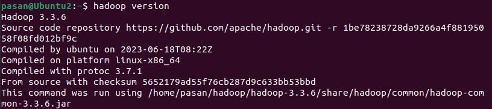
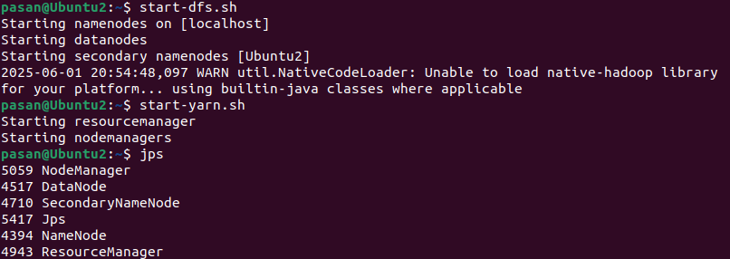
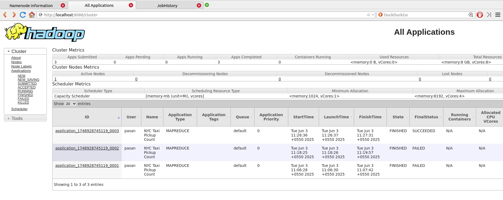
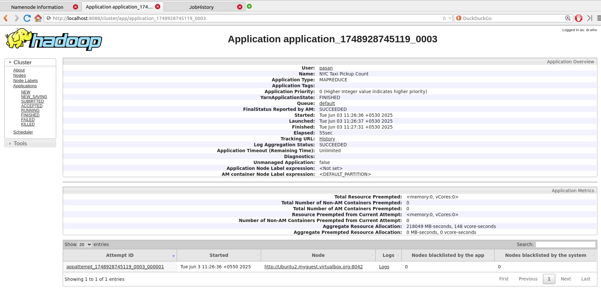
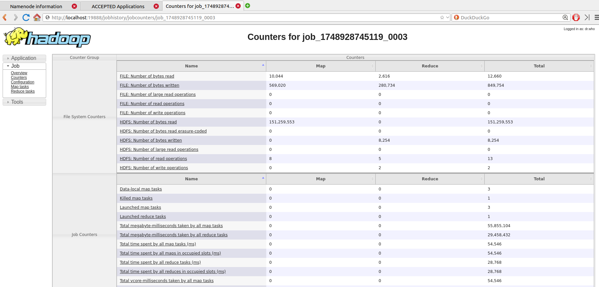
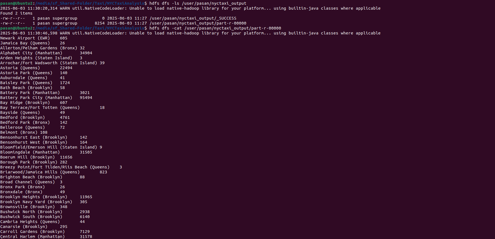
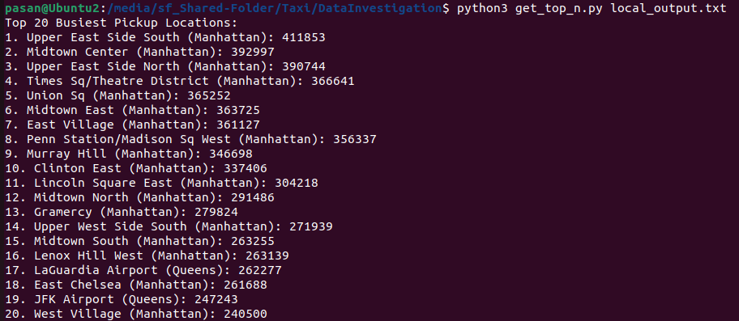

# NYC Taxi Pickup Hotspot Analysis using Hadoop MapReduce

#### **Module Name:** Cloud Computing
#### **Module Number:** EC7205
#### **Assignment Title:** Large-Scale Data Analysis Using MapReduce
#### **Team Members:** 
1. Abeysekara P.K. (EG/2020/3799)
2. Aralugaswaththa S.V.C.R.P (EG/2020/3827)
3. De Silva K.B.L.H. (EG/2020/3882)

This project fulfills the requirements for Assignment 1 by implementing a custom MapReduce job using Hadoop to process a real-world dataset (NYC Yellow Taxi trip data) and extract meaningful insights regarding taxi pickup hotspots.

## 1. Project Objective & Task


The primary objective is to identify the busiest taxi pickup locations within New York City by processing one month of taxi trip records (January 2016). This involves:
*   Counting the total number of pickups for each distinct taxi zone.
*   Joining these counts with a lookup table to associate zone IDs with human-readable names (Zone and Borough).
*   Presenting the Top N busiest zones to highlight areas of high taxi demand.

This task aligns with typical "aggregation" and "counting" patterns well-suited for MapReduce, similar to "Log Analysis" (extracting top IPs) or "Sales Aggregation" mentioned in the assignment brief.

## 2. [Dataset](https://www.nyc.gov/site/tlc/about/tlc-trip-record-data.page) Chosen & Appropriateness

We selected a **publicly available dataset** as encouraged by the assignment guidelines. The dataset consists of two main parts:

**a. NYC Yellow Taxi Trip Data:**

*   **Source:** NYC Taxi & Limousine Commission (TLC) Trip Record Data (a well-known public dataset)
*   **File Used:** `yellow_tripdata_2016-01.parquet` (Data for January 2016)
*   **Format:** Apache Parquet (a columnar format suitable for large-scale data processing)
*   **Size:** Approximately 10.9 million records, significantly exceeding the 100,000-row minimum requirement.
*   **Complexity & Realism:** This is real-world data, inherently complex with numerous fields, varied data types, and potential for missing/dirty data, making it a realistic and challenging dataset for MapReduce.
*   **Relevant Column for Task:** `PULocationID` (Pickup Location ID).
*   **Download Link:** [yellow_tripdata_2016-01.parquet](https://d37ci6vzurychx.cloudfront.net/trip-data/yellow_tripdata_2016-01.parquet)

**b. Taxi Zone Lookup Table:**

*   **Source:** NYC TLC - Taxi Zones
*   **File Used:** `taxi_zone_lookup.csv`
*   **Format:** CSV
*   **Relevant Columns:** `LocationID`, `Borough`, `Zone`
*   **Purpose:** Essential for converting numeric `PULocationID`s into meaningful, interpretable results (Zone and Borough names). This join operation adds to the complexity and real-world applicability of the task.
*   **Download Link:** [taxi_zone_lookup.csv](https://d37ci6vzurychx.cloudfront.net/misc/taxi_zone_lookup.csv)

The chosen dataset is public, real-world, and large-scale (10.9M records). Its structure (Parquet format, multiple columns) and the nature of the task (aggregation, join) are well-suited for a MapReduce solution. The task addresses a real-world problem of identifying high-demand areas, demonstrating the appropriateness of the dataset for the assignment.

### Data Investigation

```bash
python3 DataInvestigation/analysis.py
```


```
--- Exploring Parquet File: ../yellow_tripdata_2016-01.parquet ---

1. Basic Information:
Shape (rows, columns): (10905067, 19)

First 5 rows:
   VendorID tpep_pickup_datetime tpep_dropoff_datetime  ...  total_amount  congestion_surcharge  airport_fee
0         1  2016-01-01 00:12:22   2016-01-01 00:29:14  ...         18.36                  None         None
1         1  2016-01-01 00:41:31   2016-01-01 00:55:10  ...         10.80                  None         None
2         1  2016-01-01 00:53:37   2016-01-01 00:59:57  ...          7.30                  None         None
3         1  2016-01-01 00:13:28   2016-01-01 00:18:07  ...          6.30                  None         None
4         1  2016-01-01 00:33:04   2016-01-01 00:47:14  ...         12.30                  None         None

[5 rows x 19 columns]

Column Data Types and Non-Null Counts:
<class 'pandas.core.frame.DataFrame'>
RangeIndex: 10905067 entries, 0 to 10905066
Data columns (total 19 columns):
 #   Column                 Non-Null Count     Dtype
---  ------                 --------------     -----
 0   VendorID               10905067 non-null  int64
 1   tpep_pickup_datetime   10905067 non-null  datetime64[us]
 2   tpep_dropoff_datetime  10905067 non-null  datetime64[us]
 3   passenger_count        10905067 non-null  int64
 4   trip_distance          10905067 non-null  float64
 5   RatecodeID             10905067 non-null  int64
 6   store_and_fwd_flag     10905067 non-null  object
 7   PULocationID           10905067 non-null  int64
 8   DOLocationID           10905067 non-null  int64
 9   payment_type           10905067 non-null  int64
 10  fare_amount            10905067 non-null  float64
 11  extra                  10905067 non-null  float64
 12  mta_tax                10905067 non-null  float64
 13  tip_amount             10905067 non-null  float64
 14  tolls_amount           10905067 non-null  float64
 15  improvement_surcharge  10905067 non-null  float64
 16  total_amount           10905067 non-null  float64
 17  congestion_surcharge   0 non-null         object
 18  airport_fee            0 non-null         object
dtypes: datetime64[us](2), float64(8), int64(6), object(3)
memory usage: 1.5+ GB

2. Null Value Analysis:
                      Null Count  Null Percentage (%)
congestion_surcharge    10905067                100.0
airport_fee             10905067                100.0

3. Descriptive Statistics (Numerical Columns):
           VendorID        tpep_pickup_datetime  ... improvement_surcharge  total_amount
count  1.090507e+07                    10905067  ...          1.090507e+07  1.090507e+07
mean   1.535005e+00  2016-01-16 13:45:41.820952  ...          2.997352e-01  1.564197e+01
min    1.000000e+00         2016-01-01 00:00:00  ...         -3.000000e-01 -9.584000e+02
25%    1.000000e+00         2016-01-09 00:03:34  ...          3.000000e-01  8.300000e+00
50%    2.000000e+00         2016-01-16 03:54:24  ...          3.000000e-01  1.162000e+01
75%    2.000000e+00  2016-01-23 13:08:56.500000  ...          3.000000e-01  1.716000e+01
max    2.000000e+00         2016-01-31 23:59:59  ...          3.000000e-01  1.112716e+05
std    4.987731e-01                         NaN  ...          1.218746e-02  3.637961e+01

[8 rows x 16 columns]

4. Descriptive Statistics (Object/Categorical Columns):
              tpep_pickup_datetime       tpep_dropoff_datetime store_and_fwd_flag congestion_surcharge airport_fee
count                     10905067                    10905067           10905067                    0           0
unique                         NaN                         NaN                  2                    0           0
top                            NaN                         NaN                  N                  NaN         NaN
freq                           NaN                         NaN           10841883                  NaN         NaN
mean    2016-01-16 13:45:41.820952  2016-01-16 14:00:57.898052                NaN                  NaN         NaN
min            2016-01-01 00:00:00         2016-01-01 00:00:00                NaN                  NaN         NaN
25%            2016-01-09 00:03:34         2016-01-09 00:17:51                NaN                  NaN         NaN
50%            2016-01-16 03:54:24         2016-01-16 04:10:38                NaN                  NaN         NaN
75%     2016-01-23 13:08:56.500000         2016-01-23 13:31:23                NaN                  NaN         NaN
max            2016-01-31 23:59:59         2016-03-28 12:54:26                NaN                  NaN         NaN

5. Specific Columns of Interest for MapReduce (PULocationID):

--- PULocationID Analysis ---
Is PULocationID unique? False
Number of unique PULocationIDs: 261
Nulls in PULocationID: 0
Min PULocationID: 1
Max PULocationID: 265

Top 10 most frequent PULocationIDs:
PULocationID
237    411853
161    392997
236    390744
230    366641
234    365252
162    363725
79     361127
186    356337
170    346698
48     337406
Name: count, dtype: int64
Count of PULocationIDs <= 0: 0

6. Datetime Column Range (tpep_pickup_datetime):

--- tpep_pickup_datetime Analysis ---
Min pickup datetime: 2016-01-01 00:00:00
Max pickup datetime: 2016-01-31 23:59:59

7. Check 'congestion_surcharge' and 'airport_fee' (problematic object types):

Value counts for 'congestion_surcharge':
congestion_surcharge
None    10905067
Name: count, dtype: int64

Value counts for 'airport_fee':
airport_fee
None    10905067
Name: count, dtype: int64

--- Exploring CSV Lookup File: ../taxi_zone_lookup.csv ---

1. Basic Information:
Shape (rows, columns): (265, 4)

First 5 rows:
   LocationID        Borough                     Zone service_zone
0           1            EWR           Newark Airport          EWR
1           2         Queens              Jamaica Bay    Boro Zone
2           3          Bronx  Allerton/Pelham Gardens    Boro Zone
3           4      Manhattan            Alphabet City  Yellow Zone
4           5  Staten Island            Arden Heights    Boro Zone

Column Data Types and Non-Null Counts:
<class 'pandas.core.frame.DataFrame'>
RangeIndex: 265 entries, 0 to 264
Data columns (total 4 columns):
 #   Column        Non-Null Count  Dtype
---  ------        --------------  -----
 0   LocationID    265 non-null    int64
 1   Borough       264 non-null    object
 2   Zone          264 non-null    object
 3   service_zone  263 non-null    object
dtypes: int64(1), object(3)
memory usage: 8.4+ KB

2. Null Value Analysis:
              Null Count  Null Percentage (%)
service_zone           2             0.754717
Borough                1             0.377358
Zone                   1             0.377358

3. Specific Columns of Interest (LocationID, Borough, Zone):

--- LocationID Analysis (Lookup Table) ---
Is LocationID unique? True
Number of unique LocationIDs: 265
Nulls in LocationID: 0
Min LocationID: 1
Max LocationID: 265

Borough value counts:
Borough
Queens           69
Manhattan        69
Brooklyn         61
Bronx            43
Staten Island    20
EWR               1
Unknown           1
NaN               1
Name: count, dtype: int64

Zone value counts (Top 10):
Zone
Governor's Island/Ellis Island/Liberty Island    3
Corona                                           2
Newark Airport                                   1
Ocean Hill                                       1
Parkchester                                      1
Park Slope                                       1
Ozone Park                                       1
Old Astoria                                      1
Ocean Parkway South                              1
Oakwood                                          1
Name: count, dtype: int64
Number of unique Zones: 261

--- Comparing PULocationIDs from Trip Data with LocationIDs in Lookup Table ---
Number of unique PULocationIDs in trip data: 261
Number of unique LocationIDs in lookup table: 265

All PULocationIDs from trip data are present in the lookup table's LocationIDs (based on unique values).

INFO: 4 LocationIDs found in lookup table but NOT as PULocationIDs in this trip data sample.
Examples: [104, 204, 110, 103]

--- Exploration Complete ---
```

## 3. MapReduce Job Implementation & Logic

The analysis is performed using a single Hadoop MapReduce job written in **Java**.

### a. MapReduce Workflow:

1.  **Mapper (`PickupLocationMapper.java`):**
    *   **Input:** Each row (as a Parquet `Group` object) from `yellow_tripdata_2016-01.parquet`.
    *   **Process:** Extracts the `PULocationID` (Pickup Location ID, an integer) from each trip record. It includes robust error handling for potential `null` input records that might be passed by the Parquet reader, skipping them and incrementing a counter.
    *   **Output:** Emits intermediate key-value pairs: `(IntWritable(PULocationID), IntWritable(1))`. Each '1' represents a single pickup from that location.

2.  **Combiner (`PickupLocationCombiner.java`):**
    *   **Input:** Intermediate output from mappers on the same node, grouped by `PULocationID`: `(IntWritable(PULocationID), [Iterable<IntWritable> of 1s])`.
    *   **Process:** Performs a local aggregation by summing the counts (the '1's) for each `PULocationID` before the data is sent to the reducers.
    *   **Output:** Emits aggregated key-value pairs: `(IntWritable(PULocationID), IntWritable(partial_sum_of_pickups))`.
    *   **Purpose:** This significantly optimizes network traffic by reducing the volume of data shuffled between map and reduce phases.

3.  **Reducer (`PickupLocationReducer.java`):**
    *   **`setup()` Phase (DistributedCache Join Preparation):**
        *   Loads the `taxi_zone_lookup.csv` file (previously added to Hadoop DistributedCache by the driver) into an in-memory `HashMap`. This map stores `LocationID` -> `{Borough, Zone}`.
        *   The loading process includes robust CSV parsing: skipping the header, trimming whitespace from values, and handling potentially empty or missing borough/zone names by assigning default "Unknown" values. Error counters are used to track parsing issues.
    *   **`reduce()` Phase (Final Aggregation & Join):**
        *   **Input:** Key-value pairs grouped by `PULocationID` from the combiners: `(IntWritable(PULocationID), [Iterable<IntWritable> of partial_sums])`.
        *   **Process:**
            *   Sums all partial counts for a given `PULocationID` to calculate the `total_pickup_count`.
            *   Looks up the `PULocationID` in the in-memory `zoneLookup` map to retrieve the corresponding `Borough` and `Zone` name.
            *   If a `PULocationID` from the trip data is not found in the lookup table, it formats the output using default "Unknown Zone ID: [ID] (Unknown Borough)" and increments an error counter.
        *   **Output:** Emits final key-value pairs: `(Text(Zone Name (Borough)), IntWritable(total_pickup_count))`.

### b. Code Quality & Structure:

The project's code is designed for modularity, clarity, error resilience, and efficiency:
*   **Modularity:** Code is organized into distinct classes (Driver, Mapper, Combiner, Reducer) following MapReduce best practices.
*   **Clarity & Readability:** Descriptive naming for variables and methods, along with comments explaining complex logic sections, enhances code understanding.
*   **Error Handling:** The Mapper is designed to handle potential null input records from Parquet. The Reducer's CSV parsing is robust, managing empty fields, trimming necessities, and providing default values; Hadoop counters track processing anomalies like `NullGroupValueEncountered` or `LookupParseErrors`.
*   **Efficiency:** A Combiner minimizes shuffle data. Hadoop's Writable types are used for efficient data serialization. The DistributedCache facilitates an efficient reduce-side join with the small lookup table, loading it into memory once per reducer.
*   **Project Organization:** A standard Maven project structure ensures straightforward building and management of dependencies.

```
.
├── DataInvestigation/              # Scripts for data exploration and post-processing
│   ├── analysis.py               # (Optional: Script for initial data analysis/exploration)
│   └── get_top_n.py              # Python script for sorting and displaying Top N results
├── NYCTaxiAnalysis/                # Core MapReduce Java project (Maven structure)
│   ├── dependency-reduced-pom.xml  # POM generated by Maven Shade Plugin
│   ├── pom.xml                   # Maven project configuration for dependencies and build
│   └── src/
│       ├── main/
│       │   └── java/
│       │       └── com/
│       │           └── nyctaxi/  # Java package structure
│       │               ├── NYCTaxiDriver.java        # Configures and runs the MapReduce job
│       │               ├── PickupLocationCombiner.java # Locally aggregates counts for PULocationIDs
│       │               ├── PickupLocationMapper.java   # Extracts PULocationID and emits (ID, 1)
│       │               └── PickupLocationReducer.java  # Aggregates final counts and joins with zone names
│       └── test/                   # (Directory for optional unit tests)
│           └── java/
│               └── com/
│                   └── nyctaxi/
│                       └── AppTest.java
├── README.md                       # This file: Project documentation
├── images/                         # Directory for screenshots used in README
│   ├── 1.png
│   ├── ... (other image files) ...
│   └── image.png
└── install_hadoop.sh               # (Optional: Script for Hadoop setup assistance)

```

## 4. Setup Environment & Execution

### a. Prerequisites:
*   Java Development Kit (JDK) 1.8 or higher.
*   Apache Maven 3.x.
*   Hadoop 3.3.x (A single-node cluster was used for this project, installed locally on Ubuntu). HDFS and YARN services must be running.

### b. Hadoop Installation Evidence:




### c. Steps to Run:

1.  **Clone the Repository:**
    ```bash
    git clone https://github.com/PasanAbeysekara/Taxi-Pickup-Hotspot-Analysis-using-Hadoop-MapReduce
    cd NYCTaxiAnalysis
    ```

2.  **Build the Project:**
    Navigate to the project root (`NYCTaxiAnalysis/`) and execute:
    ```bash
    mvn clean package
    ```
    This compiles the Java source and packages it into `target/NYCTaxiAnalysis-1.0-SNAPSHOT.jar`.

3.  **Start Hadoop Services (if not already running):**
    ```bash
    start-dfs.sh
    start-yarn.sh
    # Optional, but recommended for viewing job history details:
    $HADOOP_HOME/sbin/mr-jobhistory-daemon.sh start historyserver
    ```

4.  **Upload Data to HDFS:**
    Replace `<your_username>` with your actual Hadoop username.
    ```bash
    # Create HDFS directories (if they don't exist)
    hdfs dfs -mkdir -p /user/<your_username>/nyctaxi_input
    hdfs dfs -mkdir -p /user/<your_username>/nyctaxi_lookup

    # Upload the Parquet trip data file (assuming it's in a local 'data' subfolder)
    hdfs dfs -put data/yellow_tripdata_2016-01.parquet /user/<your_username>/nyctaxi_input/

    # Upload the taxi zone lookup CSV file
    hdfs dfs -put data/taxi_zone_lookup.csv /user/<your_username>/nyctaxi_lookup/
    ```
 
5.  **Run the MapReduce Job:**
    Ensure any previous output directory is removed to prevent errors:
    ```bash
    hdfs dfs -rm -r /user/<your_username>/nyctaxi_output
    ```
    Execute the job:
    ```bash
    hadoop jar target/NYCTaxiAnalysis-1.0-SNAPSHOT.jar com.nyctaxi.NYCTaxiDriver \
    /user/<your_username>/nyctaxi_input/yellow_tripdata_2016-01.parquet \
    /user/<your_username>/nyctaxi_output \
    /user/<your_username>/nyctaxi_lookup/taxi_zone_lookup.csv
    ```
    Screenshot of the terminal showing the `hadoop jar ...` command execution and the console output indicating job submission and map/reduce progress percentages
    
    
    
    Screenshot of the YARN ResourceManager UI showing the application running or in the list of completed applications
    
    

### d. Execution Output Evidence:

Evidence of successful execution is provided through logs and output samples.

*   **MapReduce Job Log / YARN UI for Counters:**
    The YARN UI provides detailed counters demonstrating the data flow and successful completion of the job.

    
    
    
*   **Output Sample (from HDFS):**
    A sample of the direct output from the reducer, stored in HDFS:
    ```bash
    hdfs dfs -cat /user/<your_username>/nyctaxi_output/part-r-00000 | head -n 10
    ```
    Screenshot of the terminal showing the first few lines of the `part-r-00000` output file, displaying the "Zone Name (Borough) <TAB> Count" format.
    
    

## 5. Results Interpretation & Insights

The MapReduce job successfully processed all 10,905,067 records from the January 2016 taxi trip dataset. The output provides a count of taxi pickups for 261 distinct taxi zones, which were then mapped to their respective names and boroughs.

### a. Summary of Results:

The primary output is a list of taxi zones ranked by their total pickup counts. The Top 20 busiest pickup locations for January 2016 are:

1.  Upper East Side South (Manhattan): 411,853 pickups
2.  Midtown Center (Manhattan): 392,997 pickups
3.  Upper East Side North (Manhattan): 390,744 pickups
4.  Times Sq/Theatre District (Manhattan): 366,641 pickups
5.  Union Sq (Manhattan): 365,252 pickups
6.  Midtown East (Manhattan): 363,725 pickups
7.  East Village (Manhattan): 361,127 pickups
8.  Penn Station/Madison Sq West (Manhattan): 356,337 pickups
9.  Murray Hill (Manhattan): 346,698 pickups
10. Clinton East (Manhattan): 337,406 pickups
11. Lincoln Square East (Manhattan): 304,218 pickups
12. Midtown North (Manhattan): 291,486 pickups
13. Gramercy (Manhattan): 279,824 pickups
14. Upper West Side South (Manhattan): 271,939 pickups
15. Midtown South (Manhattan): 263,255 pickups
16. Lenox Hill West (Manhattan): 263,139 pickups
17. LaGuardia Airport (Queens): 262,277 pickups
18. East Chelsea (Manhattan): 261,688 pickups
19. JFK Airport (Queens): 247,243 pickups
20. West Village (Manhattan): 240,500 pickups

Screenshot of the terminal output from the `get_top_n.py` script, clearly showing the ranked Top 20 list.



### b. Patterns and Insights Discovered:

*   **Manhattan Dominance:** A significant majority of the busiest pickup locations are situated in Manhattan. This underscores Manhattan's role as the central business, entertainment, and residential hub of NYC, generating high taxi demand.
*   **Key Hubs:** Areas like Midtown (Center, East, North, South), Upper East/West Sides, Times Square/Theatre District, and financial/transportation hubs like Penn Station consistently appear at the top. This is expected due to high population density, tourist activity, and commuter traffic.
*   **Airport Traffic:** Both LaGuardia Airport and JFK Airport are prominent in the top 20, reflecting their importance as major transit points.
*   **Skewed Distribution:** The pickup counts are heavily skewed. A relatively small number of zones account for a disproportionately large share of the total pickups, while many other zones have significantly lower activity. For example, the top zone has over 400,000 pickups, while zones further down the list have far fewer.

### c. Performance and Accuracy Observations:

*   **Performance:**
    *   The job efficiently processed ~10.9 million records. The strategic use of a **Combiner** was vital for performance, significantly reducing data shuffled to reducers (from ~10.9M map output records to ~1.2K combine output records), thereby speeding up the overall job.
    *   Reading from Parquet (a columnar format) is efficient for queries accessing a limited subset of columns.
    *   The DistributedCache mechanism for the lookup table join is an efficient method for handling small auxiliary datasets in MapReduce.
*   **Accuracy:**
    *   The core MapReduce logic (map-combine-reduce for counting) is a standard and accurate approach for this aggregation task.
    *   The join logic's accuracy relies on the `taxi_zone_lookup.csv`. The Reducer's robust CSV parsing (handling quotes, empty fields, trimming) ensures correct mapping of IDs to names.
    *   Hadoop counters such as `ReducerSetup -> ZoneLookupEntriesLoaded` (265) and `Reduce output records` (261) align with expectations for the dataset, indicating correct processing. The minor difference (265 lookup entries vs. 261 zones with pickups) is typical, as not all defined zones may have activity in a given period.
    *   The final successful run showed no significant error counts for critical operations like lookup ID mismatches or parsing errors, indicating high data integrity and correct processing.

### d. Suggestions for Model Expansion:

*   **Temporal Analysis:** Incorporate `tpep_pickup_datetime` to analyze pickup hotspots by time of day (e.g., morning rush, evening), day of the week, or seasonality (comparing different months/years). This would require modifying the Mapper to emit composite keys like `((PULocationID, HourOfDay), 1)`.
*   **Dropoff Analysis:** Perform a similar analysis on `DOLocationID` to identify top dropoff zones and compare them with pickup patterns.
*   **Correlational Analysis:** Extend the job to calculate average trip distance, fare, or tip amount per pickup zone by including these fields in the mapper/reducer logic.
*   **Geospatial Visualization:** Integrate the output with GIS tools or libraries (e.g., GeoPandas, QGIS) to create heatmaps or choropleth maps of pickup intensity across NYC, providing a more intuitive visual representation.
*   **Advanced Top N:** For scenarios with an extremely large number of unique keys where sorting externally is inefficient, implement a secondary MapReduce job specifically for sorting the (Zone, Count) pairs to produce the Top N list directly within Hadoop.

## 6. Troubleshooting/Challenges Faced

Several challenges were encountered and overcome during the development of this project:
*   **Reading Parquet in Java MapReduce:** This required careful management of Parquet-related dependencies in the `pom.xml` file and correct configuration of `ParquetInputFormat` with `GroupReadSupport` in the Hadoop job driver.
*   **NullPointerExceptions in Mapper:** Early iterations faced NPEs when mappers attempted to access fields from Parquet `Group` objects. This was resolved through:
    *   Correcting type casting (e.g., ensuring `org.apache.parquet.schema.Type` was cast to `GroupType` before attempting to retrieve field lists).
    *   Implementing robust `null` checks for the `Group` object itself at the beginning of the `map` method, as the `ParquetInputFormat` can, under certain conditions (like empty or malformed splits), pass null record objects. Extensive use of logging and examining task logs via the YARN UI was critical for diagnosing these issues.
*   **DistributedCache File Handling:** Ensuring the `taxi_zone_lookup.csv` was correctly added to the DistributedCache and then accessed properly within the Reducer's `setup()` method. The key was to use the local file name (as it appears on the task node's local filesystem) rather than its HDFS path when opening the file reader.
*   **CSV Parsing Robustness:** The initial CSV parsing logic for the lookup table was simplistic. It was iteratively improved to be more robust against common CSV issues, such as inconsistent quoting, leading/trailing whitespace, and empty fields for borough or zone names, by adding trimming and default value assignments.
*   **Hadoop Environment Configuration:** Standard troubleshooting of a local Hadoop single-node setup, ensuring all necessary daemons (NameNode, DataNode, ResourceManager, NodeManager, JobHistoryServer) were running correctly and that HDFS paths were accessible.

This project provides a practical demonstration of applying Hadoop MapReduce to analyze a significant volume of real-world data, successfully navigating common challenges in Big Data processing to extract meaningful and actionable insights.
