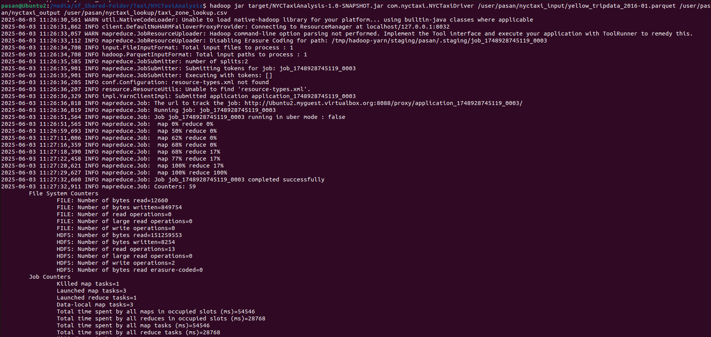
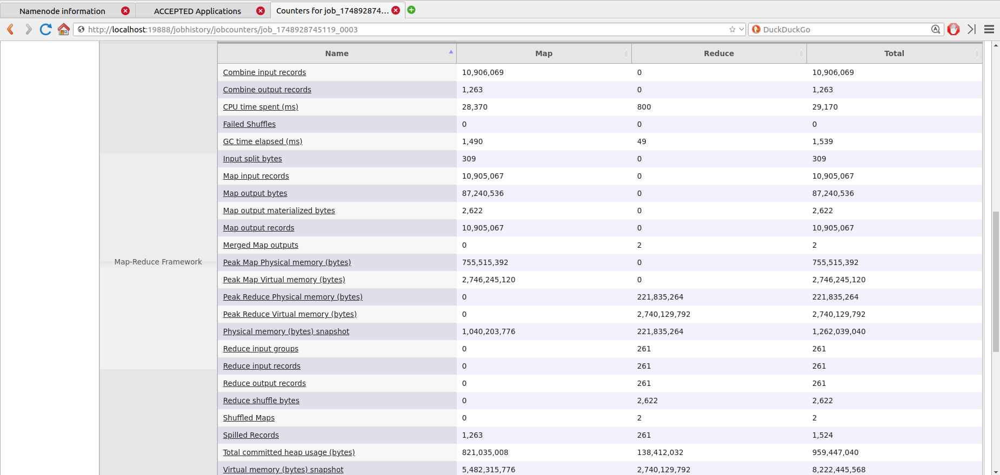

# NYC Taxi Pickup Hotspot Analysis using Hadoop MapReduce

#### **Module Name:** Cloud Computing
#### **Module Number:** EC7205
#### **Assignment Title:** Large-Scale Data Analysis Using MapReduce
#### **Team Members:**
1. Abeysekara P.K. (EG/2020/3799)
2. Aralugaswaththa S.V.C.R.P (EG/2020/3827)
3. De Silva K.B.L.H. (EG/2020/3882)

This project fulfills the requirements for Assignment 1 by implementing a custom MapReduce job using Hadoop to process a real-world dataset (NYC Yellow Taxi trip data) and extract meaningful insights regarding taxi pickup hotspots.

---

## Table of Contents

*   [Quick Start: Get Up and Running](#quick-start-get-up-and-running)
*   [Prerequisite Installation](#prerequisite-installation)
    *   [For Linux/macOS Users](#for-linuxmacos-users)
    *   [For Windows Users](#for-windows-users)
    *   [After Running the Scripts](#after-running-the-scripts)
*   [1. Project Objective & Task](#1-project-objective--task)
*   [2. Dataset Chosen & Appropriateness](#2-dataset-chosen--appropriateness)
    *   [Data Investigation](#data-investigation)
*   [3. MapReduce Job Implementation & Logic](#3-mapreduce-job-implementation--logic)
    *   [a. MapReduce Workflow Details & Example](#a-mapreduce-workflow-details--example)
    *   [b. Code Structure](#b-code-structure)
*   [4. Setup Environment & Execution](#4-setup-environment--execution)
    *   [a. Prerequisites](#a-prerequisites)
    *   [b. Hadoop Installation Evidence](#b-hadoop-installation-evidence)
    *   [c. Steps to Run (Detailed)](#c-steps-to-run-detailed)
    *   [d. Execution Output Evidence](#d-execution-output-evidence)
*   [5. Results Interpretation & Insights](#5-results-interpretation--insights)
    *   [a. Summary of Results](#a-summary-of-results)
    *   [b. Patterns and Insights Discovered](#b-patterns-and-insights-discovered)
    *   [c. Performance and Accuracy Observations](#c-performance-and-accuracy-observations)
*   [6. Troubleshooting/Challenges Faced](#6-troubleshootingchallenges-faced)

---

## Quick Start: Get Up and Running

This section provides the essential commands to clone, build, and run the NYC Taxi Hotspot Analysis application. For detailed explanations, refer to the subsequent sections.

**Prerequisites:**
*   Java Development Kit (JDK) 1.8+
*   Apache Maven 3.x
*   Hadoop 3.3.x (HDFS and YARN services must be running)
*   Git


**1. Clone the Repository:**
```bash
git clone https://github.com/PasanAbeysekara/Taxi-Pickup-Hotspot-Analysis-using-Hadoop-MapReduce
cd Taxi-Pickup-Hotspot-Analysis-using-Hadoop-MapReduce
```

**2. Build the Project:**
Navigate into the `NYCTaxiAnalysis` directory first:
```bash
cd NYCTaxiAnalysis
mvn clean package
```
This creates `target/NYCTaxiAnalysis-1.0-SNAPSHOT.jar`. After building, you might want to return to the repository root: `cd ..`

**3. Prepare Data:**

   **a. Download Data Files:**
   Download the following files (links also available in [Section 2](#2-dataset-chosen--appropriateness)):\
    *   Trip Data: [yellow_tripdata_2016-01.parquet](https://d37ci6vzurychx.cloudfront.net/trip-data/yellow_tripdata_2016-01.parquet)\
    *   Lookup Data: [taxi_zone_lookup.csv](https://d37ci6vzurychx.cloudfront.net/misc/taxi_zone_lookup.csv)

   **b. Place Data Files:**
   Create a directory named `data` at the root of the cloned repository (e.g., `Taxi-Pickup-Hotspot-Analysis-using-Hadoop-MapReduce/data/`) and place the downloaded files into it.

**4. Upload Data to HDFS:**
(Ensure you are at the root of the cloned repository. Replace `<your_username>` with your Hadoop username.)
```bash
# Create HDFS directories (if they don't exist)
hdfs dfs -mkdir -p /user/<your_username>/nyctaxi_input
hdfs dfs -mkdir -p /user/<your_username>/nyctaxi_lookup

# Upload data files from your local 'data' directory
hdfs dfs -put ./data/yellow_tripdata_2016-01.parquet /user/<your_username>/nyctaxi_input/
hdfs dfs -put ./data/taxi_zone_lookup.csv /user/<your_username>/nyctaxi_lookup/
```

**5. Run the MapReduce Job:**
(Ensure you are in the `NYCTaxiAnalysis` directory where the JAR file was built. Replace `<your_username>`.)
```bash
# Remove previous output directory (if any) to prevent errors
hdfs dfs -rm -r /user/<your_username>/nyctaxi_output

# Execute the job
hadoop jar target/NYCTaxiAnalysis-1.0-SNAPSHOT.jar com.nyctaxi.NYCTaxiDriver \
/user/<your_username>/nyctaxi_input/yellow_tripdata_2016-01.parquet \
/user/<your_username>/nyctaxi_output \
/user/<your_username>/nyctaxi_lookup/taxi_zone_lookup.csv
```

**6. View Top N Results:**
After the job completes, navigate to the root of the cloned repository.
```bash
# Get the merged output from HDFS to a local file
hdfs dfs -getmerge /user/<your_username>/nyctaxi_output ./final_output.txt

# Run the Python script to display Top N results
python3 DataInvestigation/get_top_n.py ./final_output.txt

# Optional: Clean up the local merged file
# rm ./final_output.txt
```

---

## Prerequisite Installation

Before proceeding with the setup and execution, ensure you have the necessary prerequisites. We provide helper scripts to guide you through the installation on Linux/macOS and Windows. These scripts should be located in the root of the repository (`install_prerequisites.sh` and `install_prerequisites.bat`).

### For Linux/macOS Users:

1.  Clone this repository if you haven't already.
2.  Navigate to the repository root directory.
3.  Make the script executable:
    ```bash
    chmod +x install_prerequisites.sh
    ```
4.  Run the script:
    ```bash
    ./install_prerequisites.sh
    ```
    This script will attempt to install Git, OpenJDK (1.8 or a newer LTS), and Maven using your system's package manager. It will also download Apache Hadoop (e.g., 3.3.6) to `$HOME/hadoop/hadoop-3.3.6` (or similar, check script output).

    **IMPORTANT (Hadoop):** The script only downloads and extracts Hadoop. You **MUST** configure Hadoop manually. This includes:
    *   Setting the `HADOOP_HOME` environment variable.
    *   Adding `$HADOOP_HOME/bin` and `$HADOOP_HOME/sbin` to your `PATH`.
    *   Configuring `JAVA_HOME` within `$HADOOP_HOME/etc/hadoop/hadoop-env.sh`.
    *   Setting up Hadoop configuration files (`core-site.xml`, `hdfs-site.xml`, etc.) as per the official Hadoop documentation or any specific setup scripts you might have (like the `install_hadoop.sh` mentioned elsewhere in this project).

### For Windows Users:

1.  Clone this repository if you haven't already.
2.  Navigate to the repository root directory.
3.  Run the batch script:
    ```batch
    install_prerequisites.bat
    ```
    This script will provide guidance and links for manually installing Git, OpenJDK (1.8 or newer LTS), and Apache Maven. It will also guide you on setting up the necessary environment variables (`JAVA_HOME`, `M2_HOME`/`MAVEN_HOME`, `PATH`).

    **IMPORTANT (Hadoop on Windows):**
    *   **WSL2 Recommended:** Running Hadoop natively on Windows can be complex. We **strongly recommend** using Windows Subsystem for Linux 2 (WSL2) and then following the Linux/macOS installation script (`install_prerequisites.sh`) within your WSL2 environment.
    *   **Native Windows (Advanced):** If you choose to install Hadoop natively on Windows, the script provides general guidance. You will need to:
        *   Download the Hadoop binaries.
        *   Obtain the correct `winutils.exe` and other Windows-specific Hadoop files for your Hadoop version.
        *   Manually configure `HADOOP_HOME`, `PATH`, and Hadoop configuration files (`core-site.xml`, `hdfs-site.xml`, `hadoop-env.cmd`, etc.).

### After Running the Scripts:

*   Verify each prerequisite is installed correctly and their respective `..._HOME` variables and `PATH` are properly configured.
*   You might need to open a new terminal/Command Prompt session for all environment variable changes to take effect.
*   For Hadoop, proceed with the detailed configuration steps as outlined in its official documentation or specific instructions relevant to your setup (e.g., single-node cluster setup).

---

## 1. Project Objective & Task


The primary objective is to identify the busiest taxi pickup locations within New York City by processing one month of taxi trip records (January 2016). This involves:
*   Counting the total number of pickups for each distinct taxi zone.
*   Joining these counts with a lookup table to associate zone IDs with human-readable names (Zone and Borough).
*   Presenting the Top N busiest zones to highlight areas of high taxi demand.

This task aligns with typical "aggregation" and "counting" patterns well-suited for MapReduce, similar to "Log Analysis" (extracting top IPs) or "Sales Aggregation" mentioned in the assignment brief.

## 2. Dataset Chosen & Appropriateness

We selected a **publicly available dataset** as encouraged by the assignment guidelines. The dataset consists of two main parts:

**a. NYC Yellow Taxi Trip Data:**

*   **Source:** NYC Taxi & Limousine Commission (TLC) Trip Record Data (a well-known public dataset) - [Official Link](https://www.nyc.gov/site/tlc/about/tlc-trip-record-data.page)
*   **File Used:** `yellow_tripdata_2016-01.parquet` (Data for January 2016)
*   **Format:** Apache Parquet (a columnar format suitable for large-scale data processing)
*   **Size:** Approximately 10.9 million records, significantly exceeding the 100,000-row minimum requirement.
*   **Complexity & Realism:** This is real-world data, inherently complex with numerous fields, varied data types, and potential for missing/dirty data, making it a realistic and challenging dataset for MapReduce.
*   **Relevant Column for Task:** `PULocationID` (Pickup Location ID).
*   **Download Link:** [yellow_tripdata_2016-01.parquet](https://d37ci6vzurychx.cloudfront.net/trip-data/yellow_tripdata_2016-01.parquet)

**b. Taxi Zone Lookup Table:**

*   **Source:** NYC TLC - Taxi Zones
*   **File Used:** `taxi_zone_lookup.csv`
*   **Format:** CSV
*   **Relevant Columns:** `LocationID`, `Borough`, `Zone`
*   **Purpose:** Essential for converting numeric `PULocationID`s into meaningful, interpretable results (Zone and Borough names). This join operation adds to the complexity and real-world applicability of the task.
*   **Download Link:** [taxi_zone_lookup.csv](https://d37ci6vzurychx.cloudfront.net/misc/taxi_zone_lookup.csv)

The chosen dataset is public, real-world, and large-scale (10.9M records). Its structure (Parquet format, multiple columns) and the nature of the task (aggregation, join) are well-suited for a MapReduce solution. The task addresses a real-world problem of identifying high-demand areas, demonstrating the appropriateness of the dataset for the assignment.

### Data Investigation

To understand the dataset structure, run the provided analysis script. Ensure the Parquet and CSV files are downloaded (e.g., into a parent directory `../` relative to `DataInvestigation/` or adjust path in script).
```bash
python3 DataInvestigation/analysis.py
```

**Output of `analysis.py` (summary):**
```
--- Exploring Parquet File: ../yellow_tripdata_2016-01.parquet ---

1. Basic Information:
Shape (rows, columns): (10905067, 19)

First 5 rows:
   VendorID tpep_pickup_datetime tpep_dropoff_datetime  ...  total_amount  congestion_surcharge  airport_fee
0         1  2016-01-01 00:12:22   2016-01-01 00:29:14  ...         18.36                  None         None
1         1  2016-01-01 00:41:31   2016-01-01 00:55:10  ...         10.80                  None         None
2         1  2016-01-01 00:53:37   2016-01-01 00:59:57  ...          7.30                  None         None
3         1  2016-01-01 00:13:28   2016-01-01 00:18:07  ...          6.30                  None         None
4         1  2016-01-01 00:33:04   2016-01-01 00:47:14  ...         12.30                  None         None

[5 rows x 19 columns]

Column Data Types and Non-Null Counts:
<class 'pandas.core.frame.DataFrame'>
RangeIndex: 10905067 entries, 0 to 10905066
Data columns (total 19 columns):
 #   Column                 Non-Null Count     Dtype
---  ------                 --------------     -----
 0   VendorID               10905067 non-null  int64
 1   tpep_pickup_datetime   10905067 non-null  datetime64[us]
 2   tpep_dropoff_datetime  10905067 non-null  datetime64[us]
 3   passenger_count        10905067 non-null  int64
 4   trip_distance          10905067 non-null  float64
 5   RatecodeID             10905067 non-null  int64
 6   store_and_fwd_flag     10905067 non-null  object
 7   PULocationID           10905067 non-null  int64
 8   DOLocationID           10905067 non-null  int64
 9   payment_type           10905067 non-null  int64
 10  fare_amount            10905067 non-null  float64
 11  extra                  10905067 non-null  float64
 12  mta_tax                10905067 non-null  float64
 13  tip_amount             10905067 non-null  float64
 14  tolls_amount           10905067 non-null  float64
 15  improvement_surcharge  10905067 non-null  float64
 16  total_amount           10905067 non-null  float64
 17  congestion_surcharge   0 non-null         object
 18  airport_fee            0 non-null         object
dtypes: datetime64[us](2), float64(8), int64(6), object(3)
memory usage: 1.5+ GB

2. Null Value Analysis:
                      Null Count  Null Percentage (%)
congestion_surcharge    10905067                100.0
airport_fee             10905067                100.0

3. Descriptive Statistics (Numerical Columns):
           VendorID        tpep_pickup_datetime  ... improvement_surcharge  total_amount
count  1.090507e+07                    10905067  ...          1.090507e+07  1.090507e+07
mean   1.535005e+00  2016-01-16 13:45:41.820952  ...          2.997352e-01  1.564197e+01
min    1.000000e+00         2016-01-01 00:00:00  ...         -3.000000e-01 -9.584000e+02
25%    1.000000e+00         2016-01-09 00:03:34  ...          3.000000e-01  8.300000e+00
50%    2.000000e+00         2016-01-16 03:54:24  ...          3.000000e-01  1.162000e+01
75%    2.000000e+00  2016-01-23 13:08:56.500000  ...          3.000000e-01  1.716000e+01
max    2.000000e+00         2016-01-31 23:59:59  ...          3.000000e-01  1.112716e+05
std    4.987731e-01                         NaN  ...          1.218746e-02  3.637961e+01

[8 rows x 16 columns]

4. Descriptive Statistics (Object/Categorical Columns):
              tpep_pickup_datetime       tpep_dropoff_datetime store_and_fwd_flag congestion_surcharge airport_fee
count                     10905067                    10905067           10905067                    0           0
unique                         NaN                         NaN                  2                    0           0
top                            NaN                         NaN                  N                  NaN         NaN
freq                           NaN                         NaN           10841883                  NaN         NaN
mean    2016-01-16 13:45:41.820952  2016-01-16 14:00:57.898052                NaN                  NaN         NaN
min            2016-01-01 00:00:00         2016-01-01 00:00:00                NaN                  NaN         NaN
25%            2016-01-09 00:03:34         2016-01-09 00:17:51                NaN                  NaN         NaN
50%            2016-01-16 03:54:24         2016-01-16 04:10:38                NaN                  NaN         NaN
75%     2016-01-23 13:08:56.500000         2016-01-23 13:31:23                NaN                  NaN         NaN
max            2016-01-31 23:59:59         2016-03-28 12:54:26                NaN                  NaN         NaN

5. Specific Columns of Interest for MapReduce (PULocationID):

--- PULocationID Analysis ---
Is PULocationID unique? False
Number of unique PULocationIDs: 261
Nulls in PULocationID: 0
Min PULocationID: 1
Max PULocationID: 265

Top 10 most frequent PULocationIDs:
PULocationID
237    411853
161    392997
236    390744
230    366641
234    365252
162    363725
79     361127
186    356337
170    346698
48     337406
Name: count, dtype: int64
Count of PULocationIDs <= 0: 0

6. Datetime Column Range (tpep_pickup_datetime):

--- tpep_pickup_datetime Analysis ---
Min pickup datetime: 2016-01-01 00:00:00
Max pickup datetime: 2016-01-31 23:59:59

7. Check 'congestion_surcharge' and 'airport_fee' (problematic object types):

Value counts for 'congestion_surcharge':
congestion_surcharge
None    10905067
Name: count, dtype: int64

Value counts for 'airport_fee':
airport_fee
None    10905067
Name: count, dtype: int64

--- Exploring CSV Lookup File: ../taxi_zone_lookup.csv ---

1. Basic Information:
Shape (rows, columns): (265, 4)

First 5 rows:
   LocationID        Borough                     Zone service_zone
0           1            EWR           Newark Airport          EWR
1           2         Queens              Jamaica Bay    Boro Zone
2           3          Bronx  Allerton/Pelham Gardens    Boro Zone
3           4      Manhattan            Alphabet City  Yellow Zone
4           5  Staten Island            Arden Heights    Boro Zone

Column Data Types and Non-Null Counts:
<class 'pandas.core.frame.DataFrame'>
RangeIndex: 265 entries, 0 to 264
Data columns (total 4 columns):
 #   Column        Non-Null Count  Dtype
---  ------        --------------  -----
 0   LocationID    265 non-null    int64
 1   Borough       264 non-null    object
 2   Zone          264 non-null    object
 3   service_zone  263 non-null    object
dtypes: int64(1), object(3)
memory usage: 8.4+ KB

2. Null Value Analysis:
              Null Count  Null Percentage (%)
service_zone           2             0.754717
Borough                1             0.377358
Zone                   1             0.377358

3. Specific Columns of Interest (LocationID, Borough, Zone):

--- LocationID Analysis (Lookup Table) ---
Is LocationID unique? True
Number of unique LocationIDs: 265
Nulls in LocationID: 0
Min LocationID: 1
Max LocationID: 265

Borough value counts:
Borough
Queens           69
Manhattan        69
Brooklyn         61
Bronx            43
Staten Island    20
EWR               1
Unknown           1
NaN               1
Name: count, dtype: int64

Zone value counts (Top 10):
Zone
Governor's Island/Ellis Island/Liberty Island    3
Corona                                           2
Newark Airport                                   1
Ocean Hill                                       1
Parkchester                                      1
Park Slope                                       1
Ozone Park                                       1
Old Astoria                                      1
Ocean Parkway South                              1
Oakwood                                          1
Name: count, dtype: int64
Number of unique Zones: 261

--- Comparing PULocationIDs from Trip Data with LocationIDs in Lookup Table ---
Number of unique PULocationIDs in trip data: 261
Number of unique LocationIDs in lookup table: 265

All PULocationIDs from trip data are present in the lookup table's LocationIDs (based on unique values).

INFO: 4 LocationIDs found in lookup table but NOT as PULocationIDs in this trip data sample.
Examples: [104, 204, 110, 103]

--- Exploration Complete ---
```

## 3. MapReduce Job Implementation & Logic

The analysis is performed using a single Hadoop MapReduce job written in **Java**.

**Why Hadoop MapReduce is Essential for This Task:**

The primary dataset (`yellow_tripdata_2016-01.parquet`) contains approximately **10.9 million records**. Processing this volume of data on a single machine using traditional methods would be inefficient and potentially infeasible due to:
*   **Processing Time:** Sequentially reading, parsing, aggregating, and joining millions of records would be very slow.
*   **Memory Constraints:** Holding all data or large intermediate aggregations in a single machine's memory could lead to `OutOfMemoryError` exceptions.
*   **Lack of Scalability:** Such an approach would not scale to handle larger datasets (e.g., multiple years of data).

Hadoop MapReduce is well-suited for this large-scale data analysis because it provides:
1.  **Distributed Storage (HDFS):** Manages the large Parquet file across a cluster (or a single-node setup emulating a cluster).
2.  **Distributed & Parallel Processing:** The MapReduce framework automatically splits the input data and distributes "Map" tasks to process these splits concurrently across available nodes or cores. Reducer tasks also benefit from parallelism. This significantly reduces overall processing time.
3.  **Fault Tolerance:** The framework can handle task failures by automatically rescheduling them, ensuring job completion even with hardware issues in a larger cluster.
4.  **Scalability:** Hadoop's architecture allows for horizontal scaling by adding more nodes to increase processing capacity for even larger datasets.

For our task of counting millions of taxi pickups and joining this data with zone information, Hadoop provides the necessary robust and scalable infrastructure.

### a. MapReduce Workflow Details & Example:

The core logic involves counting pickups for each `PULocationID` and then translating this ID to a human-readable zone name using a lookup table.

**Conceptual Data Snippets for Illustration:**

*   **Trip Data (from Parquet - relevant field `PULocationID`):**
    *   Record 1: `PULocationID = 161`
    *   Record 2: `PULocationID = 48`
    *   Record 3: `PULocationID = 161`
    *   Record 4: `PULocationID = 230`
    *   Record 5: `PULocationID = 161`
    *(Imagine 10.9 million such records)*

*   **Zone Lookup Data (`taxi_zone_lookup.csv` - relevant fields):**
    | LocationID | Borough   | Zone             |
    |------------|-----------|------------------|
    | 48         | Manhattan | Clinton East     |
    | 161        | Manhattan | Midtown Center   |
    | 230        | Manhattan | Times Sq/Theatre |

---

1.  **Mapper (`PickupLocationMapper.java`):**
    *   **Input:** Each row from the `yellow_tripdata_2016-01.parquet` file, represented as a Parquet `Group` object (which allows access to individual fields within a record).
    *   **Process:**
        *   For each input `Group` (trip record), the mapper extracts the integer value of the `PULocationID` field.
        *   It includes robust error handling for scenarios where the Parquet reader might pass a `null` `Group` object (e.g., due to an empty or malformed split). Such records are skipped, and a Hadoop counter (`NullGroupValueEncountered`) is incremented for monitoring.
    *   **Output (Intermediate Key-Value Pairs):** Emits the extracted `PULocationID` as an `IntWritable` key and the integer `1` as an `IntWritable` value. Each `(PULocationID, 1)` pair signifies one observed pickup from that location.
        *   Example emissions for the conceptual data:
            *   `(IntWritable(161), IntWritable(1))`
            *   `(IntWritable(48), IntWritable(1))`
            *   `(IntWritable(161), IntWritable(1))`
            *   `(IntWritable(230), IntWritable(1))`
            *   `(IntWritable(161), IntWritable(1))`

---

2.  **Shuffle and Sort (Hadoop Framework Phase):**
    *   This crucial phase, managed entirely by Hadoop, occurs after all Mappers complete.
    *   It collects all `(key, value)` pairs emitted by all Mappers.
    *   It sorts these pairs based on the key (`PULocationID`).
    *   It groups all values associated with the same key, preparing them for the Combiner or Reducer.
    *   **Example data after Shuffle & Sort (input to Combiners/Reducers):**
        *   `IntWritable(48): [IntWritable(1)]`
        *   `IntWritable(161): [IntWritable(1), IntWritable(1), IntWritable(1)]`
        *   `IntWritable(230): [IntWritable(1)]`

---

3.  **Combiner (`PickupLocationCombiner.java`):**
    *   **Purpose:** This optional but highly recommended phase acts as a "mini-reducer" that runs on the same node where map tasks finished. Its primary goal is to reduce the amount of data transferred over the network to the Reducer nodes, significantly optimizing job performance.
    *   **Input:** Receives the sorted and grouped output from the mappers that ran on its local node. For example, if three map outputs for `PULocationID=161` were processed on one node, the Combiner would receive `(IntWritable(161), Iterable<IntWritable> containing three '1's)`.
    *   **Process:** Performs a local aggregation by summing the `IntWritable` values (the '1's) for each distinct `PULocationID` it processes.
    *   **Output:** Emits aggregated key-value pairs, where the value is now a partial sum.
        *   Example emission for key 161 from one combiner instance: `(IntWritable(161), IntWritable(3))`

---

4.  **Reducer (`PickupLocationReducer.java`):**
    *   **`setup()` Phase (DistributedCache Join Preparation):**
        *   This method is called once per Reducer task before any `reduce()` calls.
        *   It loads the `taxi_zone_lookup.csv` file. This file was previously added to the Hadoop DistributedCache by the `NYCTaxiDriver`. The DistributedCache ensures the file is available locally on each node running a Reducer task.
        *   The Reducer reads this local CSV file and populates an in-memory `HashMap<Integer, String[]>`, mapping each `LocationID` to an array containing its `{Borough, Zone}`.
        *   The loading process includes robust CSV parsing logic: it skips the header row, trims whitespace from parsed string values, and handles cases where borough or zone names might be empty or missing by assigning default "Unknown" string values. Hadoop counters are used to track any parsing issues or the number of entries loaded (e.g., `ZoneLookupEntriesLoaded`).
    *   **`reduce()` Phase (Final Aggregation & Join):**
        *   **Input:** Receives data that has been shuffled and sorted from all Mappers (and Combiners, if used). The input is grouped by `PULocationID` (the key), with an `Iterable` of `IntWritable` values representing the partial sums from Combiners (or individual '1's if no Combiner ran or if keys were unique post-map).
            *   Example inputs:
                *   `(IntWritable(48), [IntWritable(1)])`
                *   `(IntWritable(161), [IntWritable(3)])` (if a single Combiner processed all for 161)
                *   `(IntWritable(230), [IntWritable(1)])`
        *   **Process:**
            1.  For each `PULocationID` key, iterates through the list of `IntWritable` values and sums them to calculate the `total_pickup_count` for that zone.
            2.  Uses the `PULocationID` (integer value of the key) to look up the corresponding Borough and Zone from the in-memory `zoneLookup` HashMap built in the `setup()` phase.
            3.  If a `PULocationID` from the trip data is not found in the lookup table (i.e., `zoneLookup.get(PULocationID)` returns null), it formats the output string to indicate an unknown zone (e.g., "Unknown Zone ID: [ID] (Unknown Borough)") and increments an error counter (`IDNotFoundInCache`).
        *   **Output:** Emits the final key-value pairs to HDFS. The key is a `Text` object containing the formatted "Zone Name (Borough)", and the value is an `IntWritable` representing the `total_pickup_count`.
            *   Example final outputs:
                *   `(Text("Clinton East (Manhattan)"), IntWritable(1))`
                *   `(Text("Midtown Center (Manhattan)"), IntWritable(3))`
                *   `(Text("Times Sq/Theatre (Manhattan)"), IntWritable(1))`

This comprehensive MapReduce pipeline efficiently transforms raw trip data into an aggregated summary of pickup hotspots, enriched with human-readable location names.

### b. Code Structure:

The project's code is designed for modularity, clarity, error resilience, and efficiency:
*   **Modularity:** Code is organized into distinct classes (Driver, Mapper, Combiner, Reducer) following MapReduce best practices.
*   **Clarity & Readability:** Descriptive naming for variables and methods, along with comments explaining complex logic sections, enhances code understanding.
*   **Error Handling:** The Mapper is designed to handle potential null input records from Parquet. The Reducer's CSV parsing is robust, managing empty fields, trimming necessities, and providing default values; Hadoop counters track processing anomalies like `NullGroupValueEncountered` or `LookupParseErrors`.
*   **Efficiency:** A Combiner minimizes shuffle data. Hadoop's Writable types are used for efficient data serialization. The DistributedCache facilitates an efficient reduce-side join with the small lookup table, loading it into memory once per reducer.
*   **Project Organization:** A standard Maven project structure ensures straightforward building and management of dependencies.

```
.
├── DataInvestigation/              # Scripts for data exploration and post-processing
│   ├── analysis.py               # Script for initial data analysis/exploration
│   └── get_top_n.py              # Python script for sorting and displaying Top N results
├── NYCTaxiAnalysis/                # Core MapReduce Java project (Maven structure)
│   ├── dependency-reduced-pom.xml  # POM generated by Maven Shade Plugin
│   ├── pom.xml                   # Maven project configuration for dependencies and build
│   └── src/
│       ├── main/
│       │   └── java/
│       │       └── com/
│       │           └── nyctaxi/  # Java package structure
│       │               ├── NYCTaxiDriver.java        # Configures and runs the MapReduce job
│       │               ├── PickupLocationCombiner.java # Locally aggregates counts for PULocationIDs
│       │               ├── PickupLocationMapper.java   # Extracts PULocationID and emits (ID, 1)
│       │               └── PickupLocationReducer.java  # Aggregates final counts and joins with zone names
│       └── test/                   # (Directory for optional unit tests)
│           └── java/
│               └── com/
│                   └── nyctaxi/
│                       └── AppTest.java
├── README.md                       # This file: Project documentation
├── images/                         # Directory for screenshots used in README
│   ├── 1.png
│   ├── ... (other image files) ...
│   └── image.png
└── install_hadoop.sh               # (Optional: Script for Hadoop setup assistance)
```

## 4. Setup Environment & Execution

### a. Prerequisites:
*   Java Development Kit (JDK) 1.8 or higher.
*   Apache Maven 3.x.
*   Hadoop 3.3.x (A single-node cluster was used for this project, installed locally on Ubuntu). HDFS and YARN services must be running.
*   Git for cloning the repository.

### b. Hadoop Installation Evidence:
Screenshots demonstrating a functional Hadoop environment:


### c. Steps to Run (Detailed):

These steps provide a comprehensive guide. For a quicker set of commands, see the [Quick Start](#quick-start-get-up-and-running) section.

1.  **Clone the Repository:**
    ```bash
    git clone https://github.com/PasanAbeysekara/Taxi-Pickup-Hotspot-Analysis-using-Hadoop-MapReduce
    cd Taxi-Pickup-Hotspot-Analysis-using-Hadoop-MapReduce
    ```

2.  **Download Data:**
    Download `yellow_tripdata_2016-01.parquet` and `taxi_zone_lookup.csv` from the links provided in [Section 2](#2-dataset-chosen--appropriateness). Create a directory named `data` at the root of the cloned repository (e.g., `Taxi-Pickup-Hotspot-Analysis-using-Hadoop-MapReduce/data/`) and place the downloaded files into this `data` directory.

3.  **Build the Project:**
    Navigate to the `NYCTaxiAnalysis/` sub-directory:
    ```bash
    cd NYCTaxiAnalysis
    mvn clean package
    ```
    This compiles the Java source and packages it into `target/NYCTaxiAnalysis-1.0-SNAPSHOT.jar`. After building, you may want to return to the repository root: `cd ..`

4.  **Start Hadoop Services (if not already running):**
    ```bash
    # Ensure these are run from $HADOOP_HOME/sbin or have $HADOOP_HOME/sbin in your PATH
    start-dfs.sh
    start-yarn.sh
    # Optional, but recommended for viewing job history details:
    mr-jobhistory-daemon.sh start historyserver
    ```

5.  **Upload Data to HDFS:**
    (Run from the root of the cloned repository. Replace `<your_username>` with your actual Hadoop username.)
    ```bash
    # Create HDFS directories (if they don't exist)
    hdfs dfs -mkdir -p /user/<your_username>/nyctaxi_input
    hdfs dfs -mkdir -p /user/<your_username>/nyctaxi_lookup

    # Upload the Parquet trip data file from your local 'data' subfolder
    hdfs dfs -put ./data/yellow_tripdata_2016-01.parquet /user/<your_username>/nyctaxi_input/

    # Upload the taxi zone lookup CSV file from your local 'data' subfolder
    hdfs dfs -put ./data/taxi_zone_lookup.csv /user/<your_username>/nyctaxi_lookup/
    ```

6.  **Run the MapReduce Job:**
    Navigate to the `NYCTaxiAnalysis/` directory (where the JAR is located).
    Ensure any previous output directory is removed to prevent errors:
    ```bash
    hdfs dfs -rm -r /user/<your_username>/nyctaxi_output
    ```
    Execute the job:
    ```bash
    hadoop jar target/NYCTaxiAnalysis-1.0-SNAPSHOT.jar com.nyctaxi.NYCTaxiDriver \
    /user/<your_username>/nyctaxi_input/yellow_tripdata_2016-01.parquet \
    /user/<your_username>/nyctaxi_output \
    /user/<your_username>/nyctaxi_lookup/taxi_zone_lookup.csv
    ```
    Terminal output during job execution:
    
     <!-- Note: Original README used images/1.png twice, keeping as is -->

    YARN ResourceManager UI showing application status:
    
    

### d. Execution Output Evidence:

Evidence of successful execution is provided through logs and output samples.

*   **MapReduce Job Log / YARN UI for Counters:**
    The YARN UI provides detailed counters demonstrating the data flow and successful completion of the job.
    
    

*   **Output Sample (from HDFS):**
    A sample of the direct output from the reducer, stored in HDFS:
    ```bash
    hdfs dfs -cat /user/<your_username>/nyctaxi_output/part-r-00000 | head -n 10
    ```
    Terminal showing HDFS output sample:
    
    

## 5. Results Interpretation & Insights

The MapReduce job successfully processed all 10,905,067 records from the January 2016 taxi trip dataset. The output provides a count of taxi pickups for 261 distinct taxi zones, which were then mapped to their respective names and boroughs.

### a. Summary of Results:

The primary output is a list of taxi zones ranked by their total pickup counts. To view the ranked list, use the `get_top_n.py` script as described in the [Quick Start](#quick-start-get-up-and-running) (Step 6) or [Section 4.c](#c-steps-to-run-detailed).

The Top 20 busiest pickup locations for January 2016 are:

1.  Upper East Side South (Manhattan): 411,853 pickups
2.  Midtown Center (Manhattan): 392,997 pickups
3.  Upper East Side North (Manhattan): 390,744 pickups
4.  Times Sq/Theatre District (Manhattan): 366,641 pickups
5.  Union Sq (Manhattan): 365,252 pickups
6.  Midtown East (Manhattan): 363,725 pickups
7.  East Village (Manhattan): 361,127 pickups
8.  Penn Station/Madison Sq West (Manhattan): 356,337 pickups
9.  Murray Hill (Manhattan): 346,698 pickups
10. Clinton East (Manhattan): 337,406 pickups
11. Lincoln Square East (Manhattan): 304,218 pickups
12. Midtown North (Manhattan): 291,486 pickups
13. Gramercy (Manhattan): 279,824 pickups
14. Upper West Side South (Manhattan): 271,939 pickups
15. Midtown South (Manhattan): 263,255 pickups
16. Lenox Hill West (Manhattan): 263,139 pickups
17. LaGuardia Airport (Queens): 262,277 pickups
18. East Chelsea (Manhattan): 261,688 pickups
19. JFK Airport (Queens): 247,243 pickups
20. West Village (Manhattan): 240,500 pickups

Screenshot of the terminal output from the `get_top_n.py` script:


### b. Patterns and Insights Discovered:

*   **Manhattan Dominance:** A significant majority of the busiest pickup locations are situated in Manhattan. This underscores Manhattan's role as the central business, entertainment, and residential hub of NYC, generating high taxi demand.
*   **Key Hubs:** Areas like Midtown (Center, East, North, South), Upper East/West Sides, Times Square/Theatre District, and financial/transportation hubs like Penn Station consistently appear at the top. This is expected due to high population density, tourist activity, and commuter traffic.
*   **Airport Traffic:** Both LaGuardia Airport and JFK Airport are prominent in the top 20, reflecting their importance as major transit points.
*   **Skewed Distribution:** The pickup counts are heavily skewed. A relatively small number of zones account for a disproportionately large share of the total pickups, while many other zones have significantly lower activity. For example, the top zone has over 400,000 pickups, while zones further down the list have far fewer.

### c. Performance and Accuracy Observations:

*   **Performance:**
    *   The job efficiently processed ~10.9 million records. The strategic use of a **Combiner** was vital for performance, significantly reducing data shuffled to reducers (from ~10.9M map output records to ~1.2K combine output records), thereby speeding up the overall job.
    *   Reading from Parquet (a columnar format) is efficient for queries accessing a limited subset of columns.
    *   The DistributedCache mechanism for the lookup table join is an efficient method for handling small auxiliary datasets in MapReduce.
*   **Accuracy:**
    *   The core MapReduce logic (map-combine-reduce for counting) is a standard and accurate approach for this aggregation task.
    *   The join logic's accuracy relies on the `taxi_zone_lookup.csv`. The Reducer's robust CSV parsing (handling quotes, empty fields, trimming) ensures correct mapping of IDs to names.
    *   Hadoop counters such as `ReducerSetup -> ZoneLookupEntriesLoaded` (265) and `Reduce output records` (261) align with expectations for the dataset, indicating correct processing. The minor difference (265 lookup entries vs. 261 zones with pickups) is typical, as not all defined zones may have activity in a given period.
    *   The final successful run showed no significant error counts for critical operations like lookup ID mismatches or parsing errors, indicating high data integrity and correct processing.

## 6. Troubleshooting/Challenges Faced

Several challenges were encountered and overcome during the development of this project:
*   **Reading Parquet in Java MapReduce:** This required careful management of Parquet-related dependencies in the `pom.xml` file and correct configuration of `ParquetInputFormat` with `GroupReadSupport` in the Hadoop job driver.
*   **NullPointerExceptions in Mapper:** Early iterations faced NPEs when mappers attempted to access fields from Parquet `Group` objects. This was resolved through:
    *   Correcting type casting (e.g., ensuring `org.apache.parquet.schema.Type` was cast to `GroupType` before attempting to retrieve field lists).
    *   Implementing robust `null` checks for the `Group` object itself at the beginning of the `map` method, as the `ParquetInputFormat` can, under certain conditions (like empty or malformed splits), pass null record objects. Extensive use of logging and examining task logs via the YARN UI was critical for diagnosing these issues.
*   **DistributedCache File Handling:** Ensuring the `taxi_zone_lookup.csv` was correctly added to the DistributedCache and then accessed properly within the Reducer's `setup()` method. The key was to use the local file name (as it appears on the task node's local filesystem) rather than its HDFS path when opening the file reader.
*   **CSV Parsing Robustness:** The initial CSV parsing logic for the lookup table was simplistic. It was iteratively improved to be more robust against common CSV issues, such as inconsistent quoting, leading/trailing whitespace, and empty fields for borough or zone names, by adding trimming and default value assignments.
*   **Hadoop Environment Configuration:** Standard troubleshooting of a local Hadoop single-node setup, ensuring all necessary daemons (NameNode, DataNode, ResourceManager, NodeManager, JobHistoryServer) were running correctly and that HDFS paths were accessible.

This project provides a practical demonstration of applying Hadoop MapReduce to analyze a significant volume of real-world data, successfully navigating common challenges in Big Data processing to extract meaningful and actionable insights.